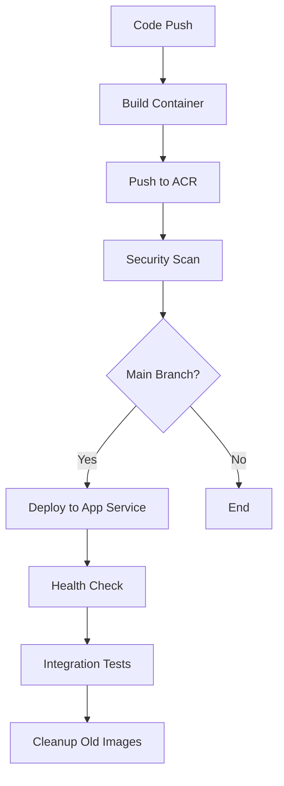

# 🚀 Automated CI/CD Setup Guide

This guide will help you set up **fully automated CI/CD** that triggers on every code commit to rebuild and push the container image to Azure Container Registry (ACR), then deploy to Azure App Service.

## 🎯 What This Achieves

- ✅ **Automatic Builds**: Every commit triggers a new container image build
- ✅ **Secure Deployment**: Images pushed to ACR and deployed to App Service
- ✅ **Branch Protection**: Only main/develop branches trigger deployments
- ✅ **Security Scanning**: Container vulnerability scanning with Trivy
- ✅ **Health Checks**: Automated verification after deployment
- ✅ **Image Cleanup**: Old container images automatically removed

## 📋 Prerequisites

1. **GitHub Repository** with your code
2. **Azure Resources** deployed (Container Registry, App Service)
3. **Azure Service Principal** for authentication
4. **GitHub Secrets** configured

## 🛠️ Step-by-Step Setup

### Step 1: Verify Infrastructure Deployment

First, ensure your Azure infrastructure is deployed:

```powershell
# Test if resources are ready
.\test-deployment.ps1

# Or deploy if needed
.\deploy-azd.ps1 -EnvironmentName "your-env-name"
```

### Step 2: Create Azure Service Principal

Create a service principal for GitHub Actions to authenticate with Azure:

```bash
# Login to Azure
az login

# Get your subscription ID
az account show --query id --output tsv

# Create service principal (replace YOUR_SUBSCRIPTION_ID)
az ad sp create-for-rbac \
  --name "github-actions-image-analysis" \
  --role "Contributor" \
  --scopes "/subscriptions/YOUR_SUBSCRIPTION_ID" \
  --json-auth

# Save the output - you'll need it for GitHub secrets!
```

**Example Output:**
```json
{
  "clientId": "12345678-1234-1234-1234-123456789012",
  "clientSecret": "your-secret-here",
  "subscriptionId": "87654321-4321-4321-4321-210987654321",
  "tenantId": "11111111-1111-1111-1111-111111111111"
}
```

### Step 3: Configure GitHub Repository Secrets

In your GitHub repository, go to **Settings > Secrets and variables > Actions** and add these secrets:

| Secret Name | Value | Example |
|-------------|-------|---------|
| `AZURE_CREDENTIALS` | Full JSON output from service principal creation | `{"clientId": "...", "clientSecret": "...", ...}` |
| `AZURE_CONTAINER_REGISTRY` | Your ACR name (without .azurecr.io) | `myappacrregistry` |
| `AZURE_RESOURCE_GROUP` | Your resource group name | `rg-image-analysis-demo` |
| `AZURE_APP_SERVICE_NAME` | Your App Service name | `app-image-analysis-demo` |

#### Quick Commands to Get Values:

```bash
# Get ACR name
az acr list --query "[0].name" --output tsv

# Get Resource Group name
az group list --query "[?contains(name, 'image-analysis')].name" --output tsv

# Get App Service name
az webapp list --query "[0].name" --output tsv
```

### Step 4: Test the Automated Workflow

1. **Make a code change** in your repository:
   ```bash
   # Example: Update the app title
   echo "# Updated App" >> streamlit_app.py
   git add .
   git commit -m "test: trigger automated CI/CD"
   git push origin main
   ```

2. **Monitor the workflow**:
   - Go to your GitHub repository
   - Click **Actions** tab
   - Watch the "Build and Deploy to Azure" workflow

3. **Verify deployment**:
   - Check the workflow completes successfully
   - Visit your App Service URL to see the updated app

## 🔄 How the Automation Works

### Trigger Events

The CI/CD pipeline triggers on:
- ✅ **Push to main branch** → Full build, deploy, and test
- ✅ **Push to develop branch** → Build and security scan only
- ✅ **Pull requests to main** → Build and validation
- ✅ **Manual dispatch** → On-demand deployment

### Workflow Steps



## 🚨 Troubleshooting

### Common Issues and Solutions

#### 1. Authentication Failures
```bash
# Verify service principal has correct permissions
az role assignment list --assignee YOUR_CLIENT_ID --output table
```

#### 2. Container Registry Access Denied
```bash
# Check ACR login
az acr login --name YOUR_ACR_NAME

# Verify ACR permissions
az acr show --name YOUR_ACR_NAME --query "adminUserEnabled"
```

#### 3. App Service Deployment Issues
```bash
# Check App Service logs
az webapp log tail --name YOUR_APP_NAME --resource-group YOUR_RG_NAME

# Restart the app service
az webapp restart --name YOUR_APP_NAME --resource-group YOUR_RG_NAME
```

#### 4. GitHub Secrets Validation
Create this test file to validate secrets:

`.github/workflows/test-secrets.yml`:
```yaml
name: Test Secrets
on: workflow_dispatch

jobs:
  test:
    runs-on: ubuntu-latest
    steps:
    - name: Test Azure Login
      uses: azure/login@v1
      with:
        creds: ${{ secrets.AZURE_CREDENTIALS }}
    
    - name: Test ACR Access
      run: |
        echo "ACR: ${{ secrets.AZURE_CONTAINER_REGISTRY }}"
        az acr list --query "[?name=='${{ secrets.AZURE_CONTAINER_REGISTRY }}'].name" -o tsv
```

## 📊 Monitoring Your CI/CD

### GitHub Actions Dashboard
- Monitor build times and success rates
- View deployment history
- Check security scan results

### Azure Portal Monitoring
- **Container Registry**: Image repository and sizes
- **App Service**: Performance metrics and logs
- **Application Insights**: Detailed telemetry

### Key Metrics to Watch
- ✅ Build success rate > 95%
- ✅ Deployment time < 5 minutes
- ✅ Zero critical security vulnerabilities
- ✅ Health check success rate 100%

## 🎯 Next Steps

### Optional Enhancements

1. **Add staging environment**:
   ```yaml
   # In deploy-to-azure.yml, add staging job
   deploy-staging:
     if: github.ref == 'refs/heads/develop'
     # ... staging deployment steps
   ```

2. **Add performance testing**:
   ```yaml
   # Add load testing step
   - name: Performance Test
     run: |
       curl -w "@curl-format.txt" -s https://your-app.azurewebsites.net
   ```

3. **Slack/Teams notifications**:
   ```yaml
   # Add notification step
   - name: Notify Team
     uses: 8398a7/action-slack@v3
     with:
       status: ${{ job.status }}
   ```

## ✅ Verification Checklist

- [ ] Azure infrastructure deployed successfully
- [ ] Service principal created with correct permissions
- [ ] GitHub secrets configured correctly
- [ ] First automated deployment completed successfully
- [ ] Health checks passing
- [ ] Security scans completing without critical issues
- [ ] Old images being cleaned up automatically

## 🔗 Useful Commands

```bash
# Quick deploy test
git commit --allow-empty -m "test: trigger CI/CD" && git push

# Check recent deployments
az webapp deployment list --name YOUR_APP_NAME --resource-group YOUR_RG_NAME

# Monitor container logs live
az webapp log tail --name YOUR_APP_NAME --resource-group YOUR_RG_NAME

# List container images in ACR
az acr repository list --name YOUR_ACR_NAME --output table
```

---

🎉 **Congratulations!** Your automated CI/CD pipeline is now set up. Every code commit will automatically build, test, and deploy your containerized application to Azure!
