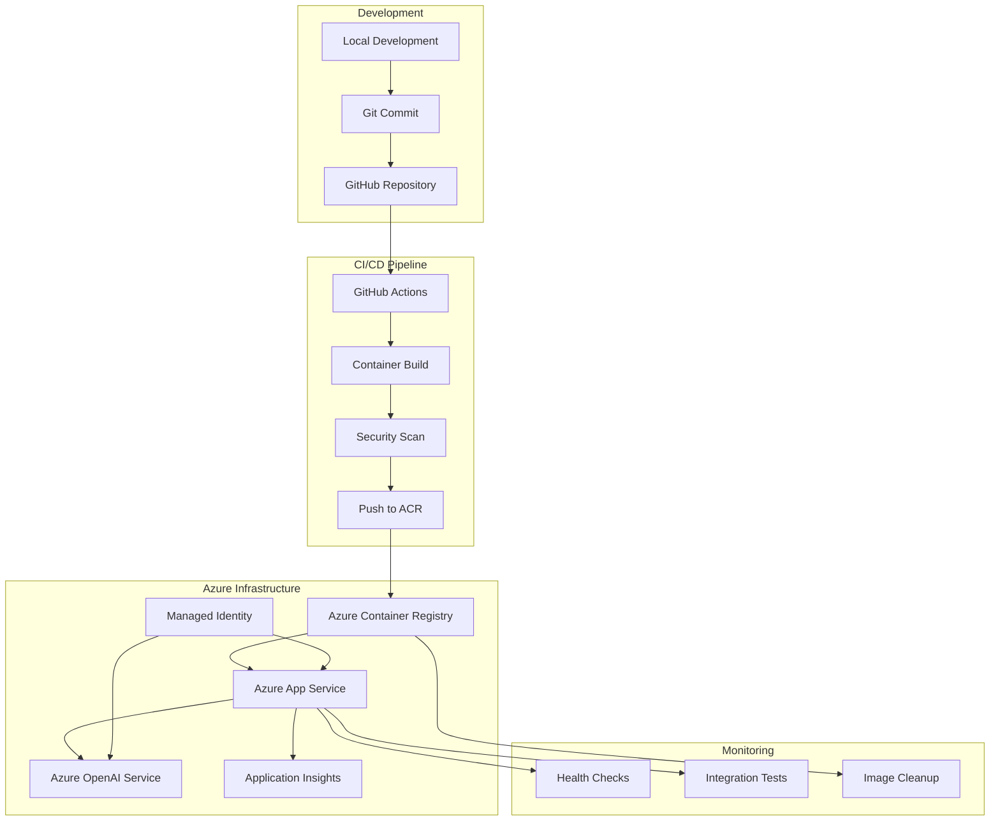

# 🚀 Azure AI Image Analysis Demo with Automated CI/CD

A fully containerized Streamlit application leveraging Azure OpenAI's GPT-4o vision model for intelligent image analysis, complete with **automated CI/CD pipeline** that builds and deploys on every commit.

## ✨ Key Features

- 🤖 **AI-Powered Image Analysis** using Azure OpenAI GPT-4o
- 🐳 **Containerized Deployment** with Azure Container Registry + App Service  
- 🔄 **Automated CI/CD** - Deploy on every commit to main/develop
- 🔐 **Secure Authentication** using Azure Managed Identity
- 🛡️ **Security Scanning** with Trivy vulnerability detection
- 📊 **Health Monitoring** with built-in checks and Application Insights
- 🧪 **Automated Testing** and integration validation

## 🏗️ Architecture



### Azure Services Used

- **Azure Container Registry** - Secure container image storage
- **Azure App Service** - Scalable web app hosting
- **Azure OpenAI Service** - GPT-4o vision model for image analysis
- **User-Assigned Managed Identity** - Secure authentication
- **Azure AI Hub & Project** - AI project management
- **Application Insights** - Monitoring and telemetry
- **Storage Account** - Required for AI Hub
- **Key Vault** - Secure credential storage

## 🚀 Quick Start - Automated Setup

### One-Command Setup

```powershell
# Complete automated CI/CD setup
.\setup-complete-cicd.ps1
```

This script will:
1. ✅ Deploy Azure infrastructure
2. ✅ Validate all prerequisites  
3. ✅ Create service principal for GitHub Actions
4. ✅ Set up automated CI/CD pipeline
5. ✅ Provide GitHub secrets configuration
6. ✅ Test the automation with first deployment

### Step-by-Step Setup

#### 1. Deploy Infrastructure

```powershell
# Deploy with Azure Developer CLI (recommended)
.\deploy-azd.ps1 -EnvironmentName "your-app-name"

# Or with traditional Azure CLI
.\deploy.ps1 -EnvironmentName "your-app-name"
```

#### 2. Set Up Automated CI/CD

```powershell
# Validate prerequisites and create service principal
.\validate-cicd-setup.ps1 -CreateServicePrincipal

# Follow the output to configure GitHub secrets
```

#### 3. Test Automation

```powershell
# Trigger automated build and deployment
.\test-cicd-trigger.ps1
```

## 🔄 Automated CI/CD Pipeline

### What Triggers the Pipeline

- ✅ **Push to main branch** → Full build, deploy, and test
- ✅ **Push to develop branch** → Build and security scan
- ✅ **Pull requests to main** → Build and validation
- ✅ **Manual dispatch** → On-demand deployment

### Pipeline Steps

```yaml
Build → Security Scan → Push to ACR → Deploy to App Service → Health Check → Integration Test → Cleanup
```

### Automated Actions

- 🔨 **Container Build** - Docker image with Python 3.11 slim
- 🔒 **Security Scanning** - Trivy vulnerability detection
- 📦 **Image Push** - Automatic push to Azure Container Registry
- 🚀 **Deployment** - Zero-downtime deployment to App Service
- 🏥 **Health Checks** - Automated application health verification
- 🧪 **Integration Tests** - End-to-end functionality testing
- 🧹 **Cleanup** - Automatic removal of old container images

## 📋 Prerequisites

- **Azure CLI** ([Install](https://docs.microsoft.com/en-us/cli/azure/install-azure-cli))
- **Docker Desktop** ([Install](https://docs.docker.com/get-docker/))
- **Azure Developer CLI** ([Install](https://aka.ms/azure-dev/install)) - Optional but recommended
- **GitHub repository** for your code
- **Azure subscription** with appropriate permissions

## 🛠️ Development Workflow

### Local Development

```bash
# Clone and setup
git clone <your-repository>
cd image-analysis-demo
pip install -r requirements.txt

# Run locally (requires Azure login)
az login
streamlit run streamlit_app.py
```

### Making Changes

1. **Make your code changes**
2. **Commit and push to main/develop**:
   ```bash
   git add .
   git commit -m "feat: your feature description"
   git push origin main
   ```
3. **Automated pipeline runs automatically**
4. **Monitor in GitHub Actions tab**
5. **Visit your deployed app** (URL provided in deployment output)

### Manual Deployment (if needed)

```powershell
# Redeploy everything
azd deploy

# Or just redeploy the container
docker build -t <registry>.azurecr.io/streamlit-app:latest .
docker push <registry>.azurecr.io/streamlit-app:latest
az webapp restart --name <app-name> --resource-group <rg-name>
```

## 📊 Monitoring & Management

### GitHub Actions Dashboard
- Monitor build success rates and deployment times
- View security scan results
- Track deployment history

### Azure Portal
- **App Service** - Performance metrics and logs
- **Container Registry** - Image storage and sizes  
- **Application Insights** - Detailed application telemetry
- **Azure OpenAI** - Usage metrics and model performance

### Useful Commands

```powershell
# Check deployment status
az webapp show --name <app-name> --resource-group <rg-name> --query state

# View application logs
az webapp log tail --name <app-name> --resource-group <rg-name>

# List container images
az acr repository list --name <registry-name>

# Validate CI/CD setup
.\validate-cicd-setup.ps1

# Test CI/CD pipeline
.\test-cicd-trigger.ps1
```

## 🔐 Security Features

- ✅ **Managed Identity Authentication** - No API keys in code
- ✅ **HTTPS Only** - All traffic encrypted
- ✅ **RBAC Permissions** - Least privilege access model
- ✅ **Container Security** - Non-root user execution
- ✅ **Vulnerability Scanning** - Automated security checks
- ✅ **Network Security** - Azure-native integration
- ✅ **Secret Management** - GitHub secrets for CI/CD

## 📁 Project Structure

```
image-analysis-demo/
├── 🐳 Dockerfile                     # Container definition
├── 📝 .dockerignore                  # Build optimization
├── 🚀 setup-complete-cicd.ps1        # One-command setup
├── ✅ validate-cicd-setup.ps1        # Prerequisites validation
├── 🧪 test-cicd-trigger.ps1          # Pipeline testing
├── 📜 deploy-azd.ps1                 # AZD deployment
├── 📜 deploy.ps1                     # Traditional deployment
├── 📊 azure.yaml                     # AZD configuration
├── 🎯 streamlit_app.py               # Main application
├── 🧠 image_analyzer.py              # AI analysis logic
├── 📦 requirements.txt               # Python dependencies
├── 📚 README.md                      # This file
├── 📋 AUTOMATED_CICD_GUIDE.md        # Detailed CI/CD guide
├── 📄 CONTAINER_DEPLOYMENT_SUMMARY.md # Container deployment info
└── 📁 infra/                         # Infrastructure as Code
    ├── main.bicep                    # Main Bicep template
    ├── resources.bicep               # Resource definitions
    └── main.parameters.json          # Deployment parameters
└── 📁 .github/workflows/             # CI/CD Workflows
    ├── deploy-to-azure.yml           # Main deployment pipeline
    └── pr-validation.yml             # Pull request validation
```

## 🎯 Next Steps

1. **🔧 Configure GitHub Secrets** - Required for automated deployment
2. **🚀 Push Your First Commit** - Trigger the automated pipeline
3. **📊 Monitor the Pipeline** - Check GitHub Actions tab
4. **🌐 Access Your App** - Visit the deployed application URL
5. **📈 Scale as Needed** - Azure App Service auto-scaling available

## 🆘 Troubleshooting

### Common Issues

- **Build Failures**: Check Dockerfile and requirements.txt
- **Deployment Issues**: Verify GitHub secrets configuration
- **Authentication Errors**: Ensure managed identity is properly configured
- **Health Check Failures**: Check application logs in Azure Portal

### Getting Help

- **Validation Script**: `.\validate-cicd-setup.ps1` - Diagnoses common issues
- **Azure Logs**: Check App Service logs in Azure Portal
- **GitHub Actions**: Review workflow logs for specific errors
- **Documentation**: See `AUTOMATED_CICD_GUIDE.md` for detailed setup

## 📖 Additional Documentation

- 📋 **[Automated CI/CD Guide](AUTOMATED_CICD_GUIDE.md)** - Complete setup instructions
- 📦 **[Container Deployment Summary](CONTAINER_DEPLOYMENT_SUMMARY.md)** - Infrastructure details
- 🔧 **[Pipeline Setup Guide](.github/PIPELINE_SETUP.md)** - GitHub Actions configuration

---

🎉 **You now have a fully automated CI/CD pipeline for your Azure AI Image Analysis Demo!** Every commit automatically builds, tests, and deploys your application to Azure. Happy coding! 🚀